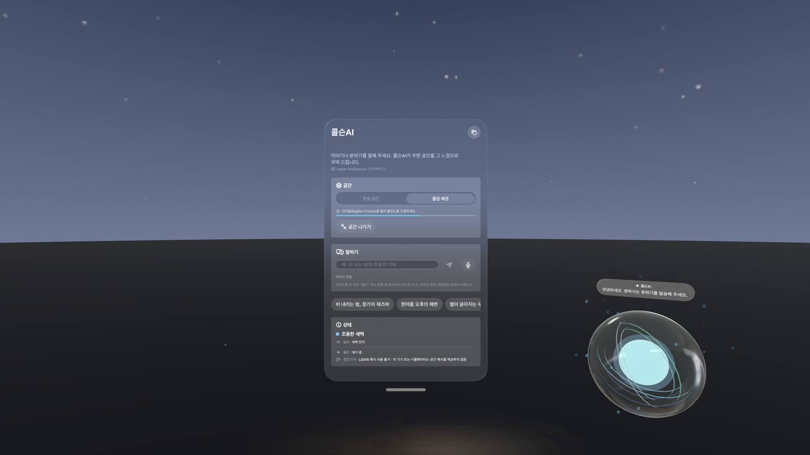
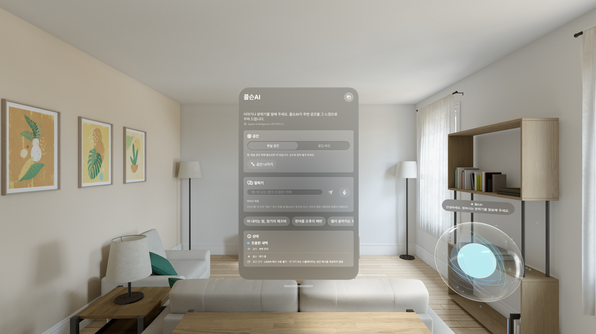
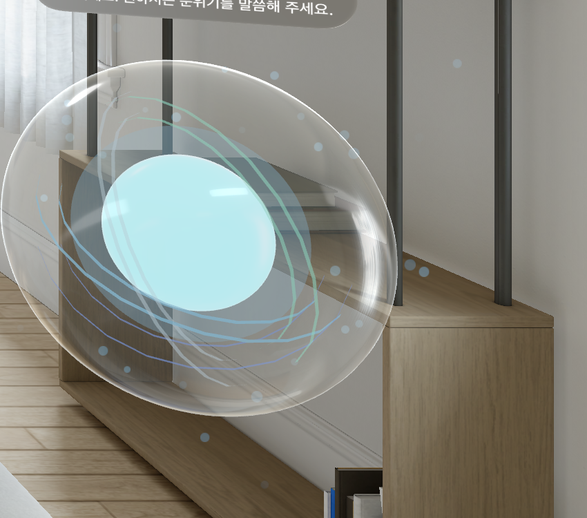
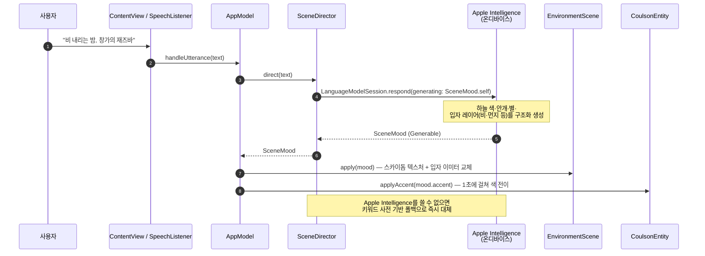
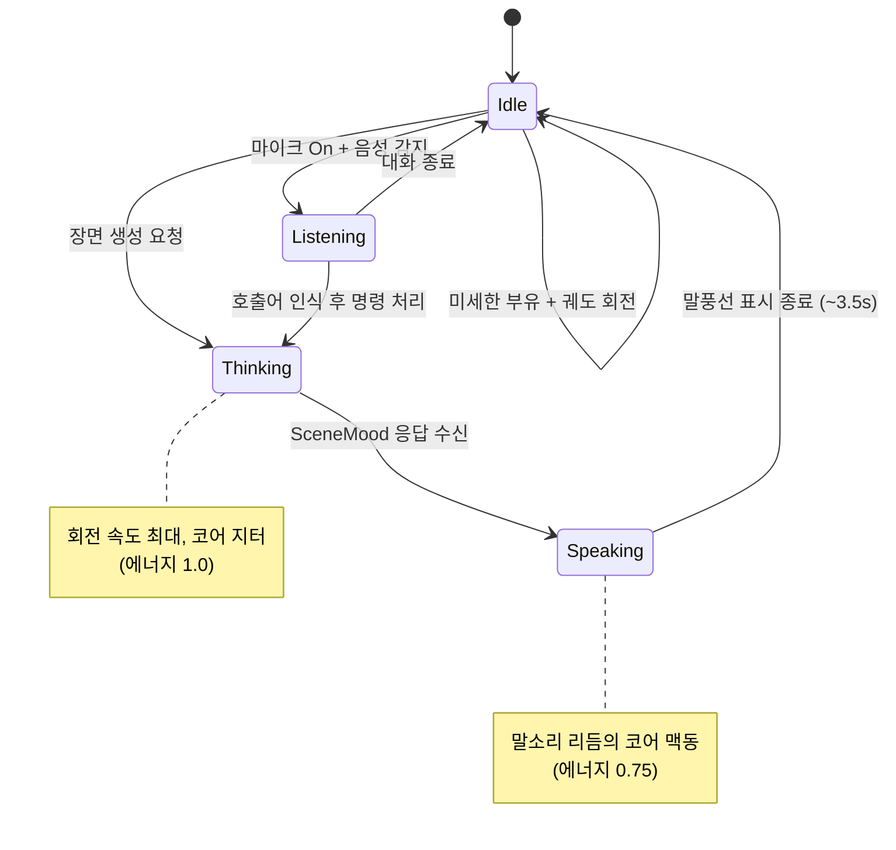

# 콜슨AI · Coulson AI

**Apple Vision Pro를 위한 온디바이스 AI 공간 컴패니언.**
말이나 글로 분위기를 설명하면, 기기 안에서만 동작하는 Apple Intelligence가 그 느낌을 해석해 주변 공간을 배경·빛·입자로 채웁니다. 마블의 자비스처럼 손으로 부르고 옮길 수 있는 "콜슨" 오브가 항상 곁에 떠 있습니다.

<p align="center">
  
</p>

<p align="center">
  
  
  
  
  
</p>

---

## 왜 만들었나

Vision Pro의 몰입형 공간은 강력하지만, 대부분의 배경은 정적이거나 미리 만들어진 것입니다. 콜슨AI는 **"지금 이 순간의 기분"을 그대로 공간에 옮기는 것**을 목표로 합니다. 클라우드로 아무것도 보내지 않고, 기기에 내장된 Apple Intelligence 언어 모델 하나로 색·조명·입자를 즉석에서 설계합니다.

## 핵심 기능

| 기능 | 설명 |
|---|---|
| 🗣️ **자연어 분위기 연출** | "비 내리는 밤, 창가의 재즈바" 같은 한 문장을 말하거나 입력하면 하늘·지면·조명·입자가 그 즉시 다시 그려집니다. |
| 🧠 **완전 온디바이스 AI** | `FoundationModels`의 `LanguageModelSession`이 기기 안에서 구조화된 장면 데이터(`@Generable`)를 직접 생성합니다. 네트워크 요청이 없습니다. |
| ✨ **콜슨 오브** | Siri 오브를 닮은 다층 발광 구체. 손으로 잡아 옮길 수 있고, 대기·듣기·생각·말하기 상태에 따라 회전·맥동이 부드럽게 변합니다. |
| 🎙️ **음성 호출** | "콜슨"이라고 부르면 온디바이스 `SpeechAnalyzer`가 호출어를 감지해 사용자 앞으로 이동하고, 이어지는 말을 명령으로 받습니다. |
| 🌧️ **키워드 기반 입자 생성** | 정해진 프리셋이 아니라, 모델이 문장 속 사물(꽃잎·반딧불·불씨·눈·비눗방울 등)을 직접 골라 입자 레이어(모양·색·크기·움직임)를 설계합니다. |
| 🌗 **두 가지 공간 모드** | **현실 공간**: 패스스루 위에 콜슨만 띄움. **몰입 배경**: Digital Crown(다이얼)으로 몰입도를 조절하는 AI 배경. |
| 🩶 **실사 그림자 (LiDAR)** | 현실 공간 모드에서 Vision Pro의 공간 인식(LiDAR) 메시로 콜슨 아래 실제 표면까지 거리를 재고, 거리에 따라 커지고 흐려지는 그림자를 그 위에 그립니다. 접근할 수 없는 기기(시뮬레이터 등)에서는 시스템 기본 그림자로 자연히 대체됩니다. |

## 화면

| 현실 공간 모드 | 콜슨 오브 클로즈업 |
|---|---|
|  |  |

> 스크린샷은 visionOS 27 시뮬레이터에서 촬영했습니다. 실기기에서는 LiDAR 기반 그림자와 몰입 배경의 조명이 추가로 표시됩니다.

## 아키텍처

컨트롤 창(2D)과 이머시브 공간(3D)이 하나의 `@Observable` 상태(`AppModel`)를 공유하는 단순한 MV 구조입니다.

```mermaid
flowchart TB
    subgraph Window["🪟 컨트롤 창 (SwiftUI)"]
        CV["ContentView<br/><i>텍스트 입력 · 모드 전환 · 상태 표시</i>"]
    end

    subgraph Space["🌐 이머시브 공간 (RealityKit)"]
        IV["ImmersiveView<br/><i>RealityView · 드래그 제스처 · 프레임 루프</i>"]
        CE["CoulsonEntity<br/><i>발광 코어 · 빛 링 4개 · 파티클 오라</i>"]
        ES["EnvironmentScene<br/><i>스카이돔 · 지면 · 입자 레이어</i>"]
        SS["SpatialSensing<br/><i>ARKit LiDAR 메시 · 헤드 포즈</i>"]
        DS["DistanceShadow<br/><i>레이캐스트 기반 실사 그림자</i>"]
    end

    subgraph Brain["🧠 온디바이스 지능"]
        AM["AppModel<br/><i>공유 상태</i>"]
        SD["SceneDirector<br/><i>LanguageModelSession 래퍼</i>"]
        SM["SceneMood / ParticleLayer<br/><i>@Generable 스키마</i>"]
        PF["ParticleFactory<br/><i>모양 스프라이트 캐시 · 이미터 조립</i>"]
        SL["SpeechListener<br/><i>SpeechAnalyzer 호출어 감지</i>"]
    end

    FM[("Apple Intelligence<br/>(FoundationModels, 온디바이스)")]

    CV -- "입력한 문장" --> AM
    SL -- "\"콜슨\" 호출 + 명령 문장" --> AM
    AM -- "장면 요청" --> SD
    SD -- "프롬프트" --> FM
    FM -- "구조화된 응답" --> SD
    SD -- "SceneMood" --> SM
    AM -- "mood 변경" --> IV
    IV --> CE
    IV --> ES
    ES -- "particles: [ParticleLayer]" --> PF
    PF -- "ParticleEmitterComponent" --> ES
    SS -- "메시 · 헤드 포즈" --> IV
    IV --> DS
    CE -- "accent 색상" --> IV

    classDef brain fill:#eef3ff,stroke:#7b93db;
    classDef space fill:#eefaf0,stroke:#6cbf84;
    classDef window fill:#fff6e8,stroke:#d9a441;
    class AM,SD,SM,PF,SL brain
    class IV,CE,ES,SS,DS space
    class CV window
```

### 문장 한 마디가 장면이 되기까지



### 콜슨의 표현 상태



## 기술 스택

- **UI**: SwiftUI (`WindowGroup` + `ImmersiveSpace`)
- **3D 렌더링**: RealityKit (`RealityView`, `ParticleEmitterComponent`, 커스텀 압출 메시)
- **온디바이스 언어 모델**: `FoundationModels` (`LanguageModelSession`, `@Generable`, `@Guide`)
- **공간 인식**: `ARKit` (`SceneReconstructionProvider`, `WorldTrackingProvider`)
- **음성 인식**: `Speech` (`SpeechAnalyzer`, `SpeechTranscriber`, 완전 온디바이스)
- **텍스처 생성**: `CoreGraphics` — 그라디언트 스카이돔과 입자 스프라이트를 GPU 부담 없이 즉석 생성

## 프로젝트 구조

```
CoulsonAndJarvis/
├── MyApp.swift              # @main, WindowGroup + ImmersiveSpace 선언
├── AppModel.swift           # 창과 이머시브 공간이 공유하는 @Observable 상태
├── ContentView.swift        # 컨트롤 창: 입력창·모드 전환·상태 패널
├── ImmersiveView.swift      # RealityView 본체, 드래그 제스처, 매 프레임 갱신
├── CoulsonEntity.swift      # 콜슨 오브(코어·빛 링·오라·유리 셸) 조립과 애니메이션
├── EnvironmentBuilder.swift # EnvironmentScene: 스카이돔·지면·입자 레이어 배치
├── SceneDirector.swift      # LanguageModelSession 래퍼 + 키워드 폴백
├── SceneMood.swift          # @Generable 장면/입자 스키마 + 폴백 카탈로그
├── ParticleFactory.swift    # 입자 스프라이트 생성·캐시, 이미터 파라미터 조립
├── SkyTextureGenerator.swift# CoreGraphics 기반 하늘 텍스처·그림자 마스크
├── SpatialSensing.swift     # ARKit LiDAR 메시 + 헤드 포즈 추적
└── SpeechListener.swift     # 온디바이스 호출어 감지 + 명령 전달
```

## 시작하기

### 요구 사항

- Xcode 27 이상
- visionOS 27 SDK / 시뮬레이터
- 실기기 테스트 시 **Apple Intelligence를 지원하는 Vision Pro** (온디바이스 모델을 쓸 수 없는 경우, 앱은 자동으로 키워드 기반 폴백 연출로 전환됩니다)

### 실행

```bash
git clone <this-repo>
open CoulsonAndJarvis.xcodeproj
```

Xcode에서 실행 대상을 `Apple Vision Pro` 시뮬레이터 또는 실기기로 선택하고 `⌘R`. 앱을 열면 컨트롤 창이 뜨고 이머시브 공간이 자동으로 열립니다.

실기기에서는 최초 실행 시 다음 권한을 요청합니다.

| 권한 | 용도 |
|---|---|
| 마이크 | "콜슨" 호출 및 음성 명령 인식 |
| 음성 인식 | 온디바이스 텍스트 변환 (서버 전송 없음) |
| 공간 인식(월드 센싱) | LiDAR 메시로 콜슨의 실사 그림자 위치·크기 계산 |

## 개인정보

이 앱은 사용자의 말·문장을 어떤 서버로도 전송하지 않습니다. 장면 생성은 `SystemLanguageModel`(Apple Intelligence)을 통해 **기기 안에서** 이뤄지며, 음성 인식 역시 `SpeechAnalyzer`의 온디바이스 모듈만 사용합니다.

## 알려진 제한사항

- visionOS 시뮬레이터는 LiDAR 공간 메시(`SceneReconstructionProvider`)를 제공하지 않아, 현실 공간 모드의 실사 그림자는 실기기에서만 확인할 수 있습니다.
- 시뮬레이터의 `SpeechAnalyzer`는 설치된 언어 모델이 없어 음성 인식이 비활성 상태로 표시됩니다.
- Apple Intelligence를 지원하지 않는 기기·설정에서는 모든 장면이 키워드 기반 폴백 팔레트로 생성됩니다.

## 라이선스

**Apache License 2.0 + [Commons Clause](https://commonsclause.com/)**

Apache-2.0의 특허 조항·귀속 표시 의무 등은 그대로 유지되며, 여기에 "이 소프트웨어를 판매하거나 그 기능이 가치의 대부분을 차지하는 유료 제품·서비스로 제공하는 것"만 금지하는 Commons Clause 조건이 추가됩니다.

- ✅ 개인·비영리·연구·교육 목적 사용, 수정, 재배포, 사내 사용 — 자유
- ❌ 이 소프트웨어(또는 그 기능이 가치 대부분을 차지하는 파생물)를 판매하거나 유료 서비스로 제공하는 것 — 금지

자세한 조건은 [`LICENSE`](LICENSE) 파일을 확인해 주세요. 이 요약은 참고용이며 실제 라이선스 조항이 우선합니다.

---

<p align="center"><i>콜슨AI는 개인 프로토타입 프로젝트입니다.</i></p>
